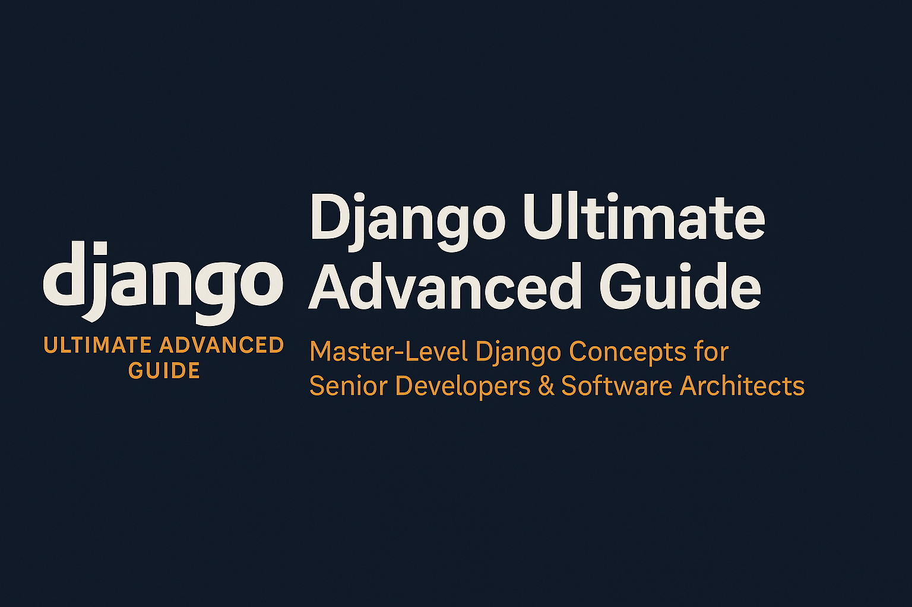

# 🌍 **Django Ultimate Advanced Guide**

### **Master-Level Django Concepts for Senior Developers & Software Architects**

**Created by Donald Programmeur — HooYia**

Welcome to the **most ambitious and deeply technical Django repository ever created**.
This guide is designed to serve as a **world-class, expert-level reference** for mastering Django at the level of enterprise architects and backend engineering leaders.

It is intended for:

* Senior Django Developers
* Software & Solutions Architects
* DevOps and Platform Engineers
* Technical Leads & Engineering Managers
* Researchers and Educators in Software Engineering

💡 **Mission:** Build the most complete, professional, and globally recognized knowledge base on *very advanced Django concepts* — going far beyond standard tutorials and typical online content.

---

# 🎥 **Complete Video Series (YouTube)**

📌 **Official Playlist — Django Advanced Masterclass**
👉 [https://studio.youtube.com/playlist/PLJuTqSmOxhNtwQA_GYpAZ_QiGXhYoWvnm/videos](https://studio.youtube.com/playlist/PLJuTqSmOxhNtwQA_GYpAZ_QiGXhYoWvnm/videos)

Every concept presented in this repository is explained in detail in the associated video series on the
🎬 **Donald Programmeur YouTube Channel** → [https://www.youtube.com/@donaldprogrammeur](https://www.youtube.com/@donaldprogrammeur)

Subscribe for continuous updates, deep dives, and new advanced topics.

---

# 🧭 **Repository Roadmap — Master Rhythm**

This repository is organized into **10+ expert-level sections**, each focusing on a high-level area of Django architecture, performance, or internals.
Every topic dives deep into how Django truly works under the hood.

---

## I. 🧩 **Django Core Internals**

* Deep dive into the App Registry
* Django application lifecycle & AppConfig
* Middleware pipeline internals
* Detailed Request/Response processing
* WSGI vs ASGI — low-level internals
* Django concurrency model
* Thread-safety and process-safety
* Internal URL Resolver mechanics

---

## II. 🧬 **ORM Internals & Advanced Query Engineering**

* QuerySet → SQL compilation (Query, Compiler, WhereNode)
* Building custom ORM backends
* Lazy evaluation and query execution flow
* Advanced annotations, subqueries, window functions
* Deep ORM performance optimization
* Expression API mastery
* Creating custom lookups and operators

---

## III. 🏛️ **Enterprise Architecture with Django**

* Django inside microservices ecosystems
* Event-driven architecture (Kafka, Redis Streams)
* Multi-tenant architectures (schema, database, row-level)
* Multi-database routing & data sharding
* CQRS & Event Sourcing with Django
* Clean Architecture / Hexagonal patterns
* API Gateway design with Kong, Nginx, Istio

---

## IV. ⚡ **Django Async & Real-Time Systems**

* ASGI internals and event loop integration
* Fully async views and async middleware
* Async ORM concepts and limitations
* WebSockets at scale (Channels, Daphne, Uvicorn)
* Combining Django + FastAPI for performance-critical endpoints

---

## V. 🏎️ **High Performance & Caching Strategies**

* Multi-layer cache architecture
* Redis advanced usage patterns
* Cache invalidation strategies
* Handling thundering-herd effects
* CDN integration (Cloudflare, CloudFront)
* Eliminating N+1 problems
* Load balancing Django in production

---

## VI. 🔐 **Security Hardening & Enterprise Compliance**

* Deep security middleware analysis
* Framework-level XSS / CSRF / SQL Injection protections
* JWT rotation, session invalidation, token lifecycles
* Secret management with Vault / AWS Secrets Manager
* SOC2, HIPAA, PCI-DSS considerations with Django

---

## VII. 🧰 **Meta-Programming & Dynamic Django**

* Generating models dynamically
* Building dynamic serializers and forms
* Metaclasses in Django architecture
* Designing a plugin-based Django system
* Code generation & automation tooling
* Creating advanced management command factories

---

## VIII. 🔄 **Distributed Tasks & Automation Pipelines**

* Advanced Celery concepts (chains, chords, groups)
* Event-driven automation & pipelines
* Airflow orchestration with Django
* Distributed task queues at scale
* Building high-availability task systems

---

## IX. 📦 **Packaging & Extending Django**

* Building high-quality Django packages
* Ensuring multi-version compatibility
* Backward-compatible migrations
* Publishing and maintaining PyPI packages
* Architecting reusable Django apps

---

## X. 🧪 **Advanced Testing Suite**

* Async test architecture
* Multi-database test patterns
* Deep mocking and dependency isolation
* Performance and benchmark testing
* Docker-based test environments
* Full end-to-end (E2E) testing strategies

---

# 🤝 **Contribution Guide**

We welcome contributions from:

* Advanced Django developers
* Software and cloud architects
* Researchers and DevOps professionals
* Open-source contributors with real-world experience

📘 Read the full guide here: **[CONTRIBUTING.md](CONTRIBUTING.md)**

---

# 📜 **License**

Distributed under the **MIT License**.
See the file **LICENSE** for details.

---

# ⭐ **Support & Community**

If this repository brings you value:

* ⭐ Star the repository
* 🔔 Subscribe to the YouTube channel
* 🔁 Share the guide with your network
* 🤝 Contribute to make it even better

Together, we are building the **world’s most advanced and comprehensive Django guide**, for developers and architects everywhere.

